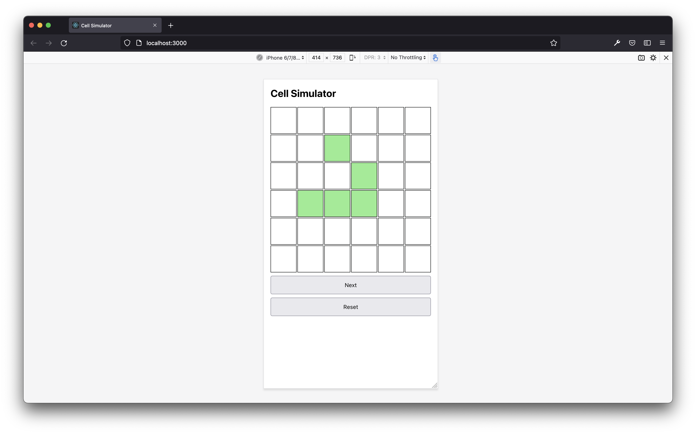

## Cell Simulator

A Cell Simulator program in React & TypeScript.

### Description

This cell-simulator is an attempt at [Conway's Game of Life](https://en.wikipedia.org/wiki/Conway%27s_Game_of_Life). It's not a zero-player implementation, after configuring the initial 
state of the game, players are required to invoke each generation by clicking a button.

It requires [yarn](https://classic.yarnpkg.com/lang/en/) v1 to build and run.

### Install

    git clone https://github.com/erkde/cell-simulator

### Run

To run a development build

    yarn start

To run a production build - requires [serve](https://www.npmjs.com/package/serve) or deployment to a host

    yarn build
    server -s build

### Test

    yarn test
